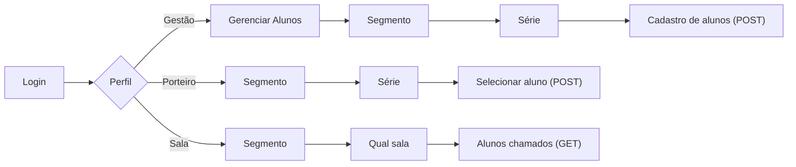

# 🔔 Saída Inteligente

**Chega de fila na portaria.** Sistema de chamada em tempo real que conecta a portaria, a gestão escolar e a sala de aula no momento da saída dos alunos.


---

## 📌 O problema

Na saída escolar, o processo de liberar cada aluno costuma depender de chamadas por interfone, deslocamento físico de funcionários ou controle manual em papel — gerando **aglomeração na portaria**, **demora** e **falta de rastreabilidade** de quem saiu e em que horário.

## 🚀 A solução

A **Saída Inteligente** é uma iniciativa de extensão universitária do curso de Sistemas de Informação, que digitaliza esse processo em tempo real, aproveitando a infraestrutura já existente na escola (TVs, projetores e outros aparatos eletrônicos):

- O porteiro registra a chamada em segundos, direto no notebook/tablet.
- O nome do aluno aparece instantaneamente na tela da sala de aula.
- A gestão mantém um cadastro completo e auditável de todos os alunos.

**Resultado:** mais segurança, mais agilidade e zero aglomeração na saída.

---

## 🎯 Objetivo

Desenvolver e implantar um sistema de chamada em tempo real para a saída dos alunos, otimizando a segurança e o fluxo do ambiente escolar, eliminando aglomerações na portaria em horários de pico e estabelecendo um controle rigoroso e auditável para a liberação de cada estudante.

---

## 🧩 Perfis de acesso

| Perfil | O que faz |
|---|---|
| 🛠️ **Gestão** | Cadastra, edita, ativa e inativa alunos da base do sistema |
| 🚪 **Porteiro** | Localiza o aluno informado pelo responsável e registra a chamada |
| 🖥️ **Sala** | Exibe em tempo real, na TV/projetor, a lista de alunos chamados da turma |

## 🔄 Fluxo resumido



> 📄 Documentação completa do fluxo, telas e endpoints disponível em [`/docs`](./docs).

---

## Modelagem de dados

O banco modela a estrutura escolar atual e preserva os registros operacionais e de auditoria. `Segmento` (por exemplo, Fundamental I) possui várias `Sala`s; cada `Sala` pertence a um único segmento e não pode repetir a mesma `serie` dentro dele. Uma Sala possui vários `Aluno`s, cuja `matricula` é única no sistema.

```mermaid
erDiagram
    Segmento ||--o{ Sala : possui
    Segmento o|--o| Usuario : "login SALA geral"
    Sala ||--o{ Aluno : possui
    Sala o|--o| Usuario : "login SALA individual"
    Aluno ||--o{ Liberacao : possui
    Usuario ||--o{ Liberacao : registra
    Aluno ||--o{ Gerenciamento : auditado_em
    Usuario ||--o{ Gerenciamento : executa
```



- `Usuario` usa as roles `GESTAO`, `PORTEIRO` e `SALA`. Para `SALA`, o login individual aponta para uma `Sala`; o login geral aponta para um `Segmento`. O escopo geral existe porque, na implementação inicial, alunos de várias Salas do mesmo Segmento podem aguardar liberação no mesmo ambiente. A API e o Socket.io usarão esse escopo futuramente. Para `GESTAO` e `PORTEIRO`, ambos os vínculos devem permanecer nulos; para `SALA`, deve existir exatamente um dos dois vínculos.
- `Aluno` tem somente a Sala atual em `salaId`: a progressão anual futura poderá atualizá-lo em lote. A remoção normal é lógica, com `ativo = false`; alunos do último ano também podem ser inativados.
- `Liberacao` é um registro histórico permanente, registrado por um usuário Porteiro. A unicidade de `alunoId` e `dataLiberacao` garante no máximo uma liberação por aluno a cada dia.
- `Gerenciamento` é a auditoria administrativa das ações de cadastro, edição, inativação, reativação e importação, sem duplicar dados de usuário ou aluno.
- As relações estruturais e históricas usam `Restrict` em exclusões para preservar a integridade: não se exclui um Segmento com Salas, uma Sala com Alunos, nem Alunos ou Usuários já referenciados no histórico.

Detalhes adicionais de operação poderão ser documentados futuramente em [`/docs`](./docs).

---

## ✨ Benefícios

**Para a instituição**
- Otimização da logística e aumento da segurança.
- Transparência na liberação dos alunos, gerando percepção de eficiência para os pais.
- Registro digital e consultável do horário exato de liberação de cada estudante — sem custos extras de infraestrutura.

**Para a equipe de desenvolvimento**
- Vivência prática de todo o ciclo de vida do desenvolvimento de software.
- Desenvolvimento de habilidades interpessoais: comunicação, gestão de projetos e negociação com usuários leigos.
- Um caso real de impacto social para o portfólio profissional.

---

## 🛠️ Tecnologias

- Frontend: React + TypeScript + Vite
- Backend: Node.js + Express + TypeScript
- Banco de dados: PostgreSQL 17.11 (Docker Compose no ambiente de desenvolvimento) + Prisma ORM
- Comunicação em tempo real: Socket.io (planejado para uma etapa posterior)

---

## ⚙️ Como executar o projeto

```bash
# Clone o repositório
git clone https://github.com/seu-usuario/saida-inteligente.git

# Acesse a pasta
cd saida-inteligente

# Terminal 1: PostgreSQL
docker compose up -d

# Terminal 2: backend
cd backend
npm install

# Antes de gerar o Prisma Client, crie backend/.env com base em backend/.env.example
# e configure DATABASE_URL com a senha local do PostgreSQL.
npm run prisma:generate
npm run dev

# Terminal 3: frontend
cd frontend
npm install
npm run dev
```

O backend inicia em `http://localhost:3000` por padrão e disponibiliza `GET /health`.
Ao iniciar o frontend, o Vite mostra a URL local da aplicação.

### Configuração do backend

O Prisma é a camada de acesso do backend ao PostgreSQL. Crie `backend/.env` a partir de [`backend/.env.example`](./backend/.env.example) e configure a `DATABASE_URL` com a senha local do PostgreSQL antes de executar `npm run prisma:generate`. Esse arquivo não é versionado.

Com o PostgreSQL local disponível, inicie a API com `npm run dev`. O backend valida a conexão com o banco antes de abrir a porta HTTP.

---

## PostgreSQL para desenvolvimento local

### Pré-requisito

Docker com Docker Compose disponível.

### Configuração

Crie o arquivo `.env` local na raiz do projeto com base em [`.env.example`](./.env.example). Defina uma senha local segura para `POSTGRES_PASSWORD`; o arquivo `.env` não é versionado.

### Inicialização

```bash
docker compose up -d
```

### Verificação

```bash
docker compose ps
```

### Logs

```bash
docker compose logs postgres
```

### Encerramento

```bash
docker compose down
```

### Reset completo

```bash
docker compose down -v
```

`-v` remove o volume e **APAGA os dados locais do PostgreSQL**.

---

## 👥 Equipe

| Nome | Função |
|---|---|
| `_______` | `_______` |
| `_______` | `_______` |
| `_______` | `_______` |

---

## 📄 Licença

Este projeto está sob a licença MIT — veja o arquivo [LICENSE](./LICENSE) para mais detalhes.

---

<p align="center">Projeto desenvolvido como parte das Atividades Práticas Interdisciplinares de Extensão II — Sistemas de Informação</p>
